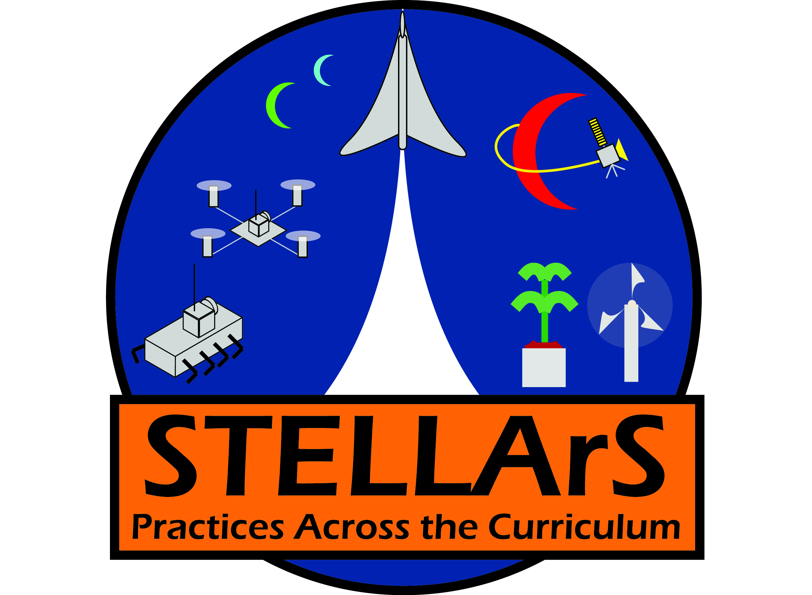
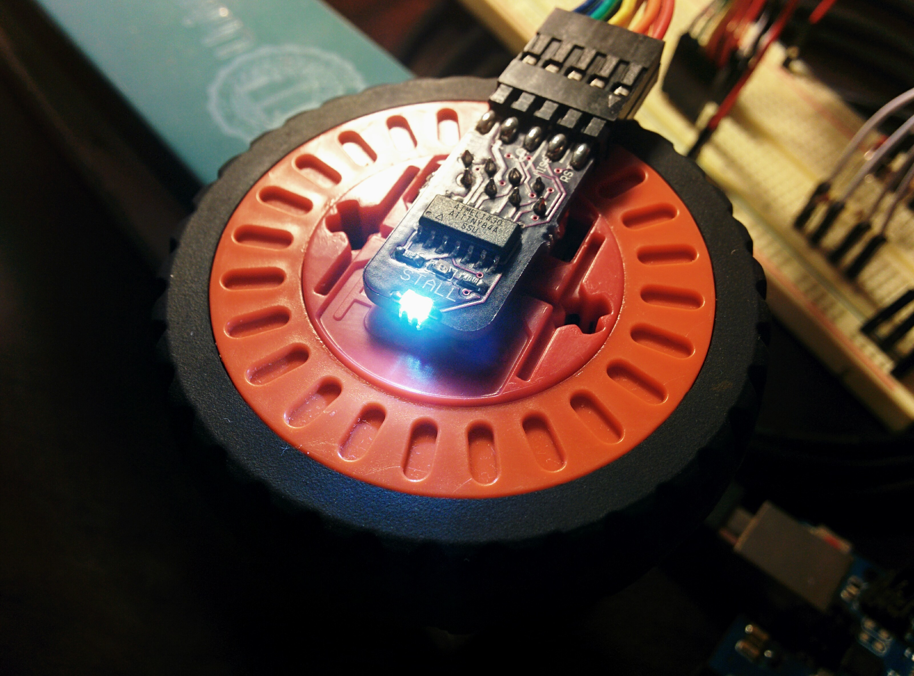

EnLiST-Rover
============

EnLiST Rover modelled on the Curiosity Rover. The goal is to use it as a teaching platform for middle and high school students.

## Motor Controller
[Motor Controller Test Video](https://www.youtube.com/watch?v=swelm4EhzFY) demonstrating PC simulation and gamepad interface.

## Prototype Photos

